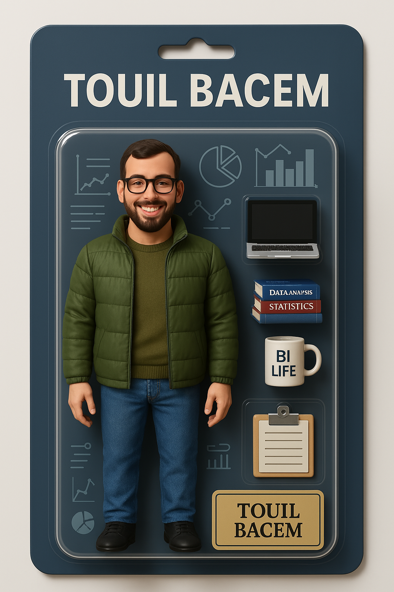

<h1 align="center">👋 Hello, I'm <strong>Bacem Touil</strong></h1>

🔥 <strong>Junior Developer & Business Intelligence Student</strong>  
🎓 Passionate BI student focused on turning data into meaningful insights. 
💻 Building practical web applications using the MERN stack. 
🚀 Continuously improving my skills in data analysis, visualization, and full-stack development. 
🌟 Committed to writing clean, efficient code and delivering data-driven solutions.

### 🛠️ Tech Stack

  

---
---

### 🚀 What I’m Currently Working On

- Developing a mobile VTC app using React Native (Expo) and Node.js/Express for the backend

---

### 📫 How to Reach Me

Feel free to connect via [LinkedIn](https://www.linkedin.com/in/touil-bacem) or send me an email at <touilbacem15@gmail.com>.  
I’m always open to discussing projects, collaborations, or new opportunities!

---

